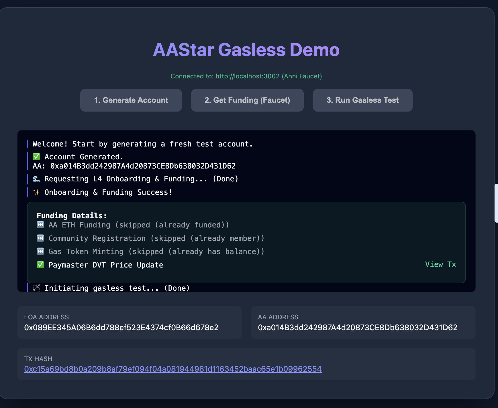
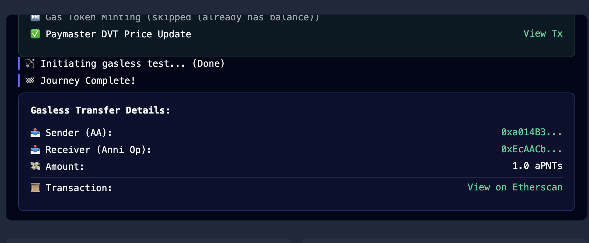

# AAStar Gasless Demo (Standalone)

[English Version](#english-readme)

这是一个独立的 Gasless Demo 演示模块，完全使用AAStar SDK，整合了 Faucet 服务和交互式 UI。

</br>


## 🚀 快速上手 (Quick Start)

### 1. 启动 Faucet 服务 (端口 3002)

在一个终端中运行：

```bash
cd local-dev-demo
./faucet.sh
访问3002,显示简单的readme。
目前也可以配置FAUCET_URL 和 FAUCET_SECRET 环境变量，从而不依赖本地faucet服务。
```
*这个脚本会启动 `faucet_service.ts`，负责处理充值和 Paymaster 设置。*

### 2. 启动 UI 服务 (端口 3001)

在另一个终端中运行：

```bash
cd local-dev-demo
./ui.sh
```
*这个脚本会启动 `demo_ui.ts` 并把日志输出到文件，然后在后台运行。*

### 3. 打开浏览器

访问 [http://localhost:3001](http://localhost:3001) 开始体验。

---

## 📂 目录结构 & 文件作用

*   **`faucet_service.ts`**: Faucet 后端核心。处理 L4 Onboarding、充值 ETH/GToken、初始化 Paymaster、强制更新预言机价格等。
*   **`demo_ui.ts`**: UI 后端服务器。提供 `/api/generate-account`, `/api/run-test` 等接口，并持久化存储账户信息。
*   **`demo_public/`**: 前端静态文件 (`index.html` 等)。
*   **`generated_accounts.json`**: 自动生成的账户存储文件。包含账户地址、私钥以及**历史交易记录 (Etherscan Links)**。
*   **`faucet.sh` / `ui.sh`**: 便捷启动脚本。

## 🛠️ 技术栈

*   **SDK**: `@aastar/sdk`, `@aastar/core`
*   **Blockchain**: Viem (Sepolia Testnet)
*   **Backend**: Node.js + Express
*   **Frontend**: Vanilla HTML/JS + Glassmorphism CSS

---

<a id="english-readme"></a>
# AAStar Gasless Demo (English)

This is a standalone module demonstrating the full Gasless Transaction flow using AAStar SDK.

## 🚀 Quick Start

### 1. Start Faucet Service (Port 3002)

Run in terminal:

```bash
cd local-dev-demo
./faucet.sh
```

### 2. Start UI Service (Port 3001)

Run in another terminal:

```bash
cd local-dev-demo
./ui.sh
```

### 3. Open Browser

Go to [http://localhost:3001](http://localhost:3001).

## 📂 Directory Structure

*   **`faucet_service.ts`**: The heavy-lifting backend. Handles funding, paymaster setup, and state initialization.
*   **`demo_ui.ts`**: The UI backend. serves APIs and persists account data.
*   **`demo_public/`**: Frontend assets.
*   **`generated_accounts.json`**: Persisted account data including private keys and **Historical Transaction Links**.
*   **`faucet.sh` / `ui.sh`**: Helper scripts.
